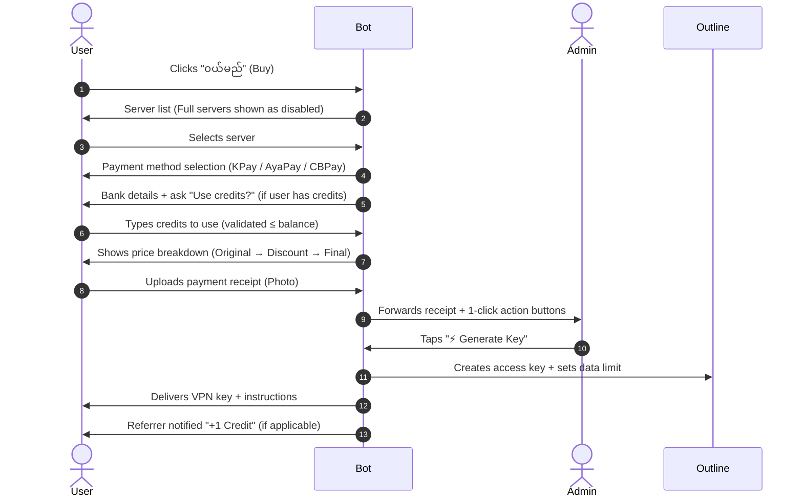

# 🤖 Ye Gu Saung VPN — Telegram Bot

An automated, multi-server **Outline VPN** subscription management and payment bot built with Node.js, Telegraf, and MySQL.


---

## ✨ Features

- 🌐 **Multi-Server Support** — Configure multiple Outline VPN servers (e.g., Thailand 🇹🇭, Singapore 🇸🇬) with per-server pricing and optional DNS hostname mapping.
- 💳 **Dynamic Payment Methods** — Multi-wallet support (KPay, AyaPay, CBPay) with interactive step-by-step inline selection.
- 🎁 **Referral & Credit System** — Users earn credits by referring friends. Credits can be applied as discounts when buying or extending a plan.
- 👥 **Server User Limit** — Enforce a maximum user count per server (`USER_LIMIT`). Full servers display as `(Full)` and block new selection.
- ⚡ **1-Click Admin Approval** — Interactive inline buttons sent to your Telegram Admin Supergroup for instant key generation and plan extension.
- 📅 **Automated Subscription Lifecycle** — Pre-expiry warnings (3 days before at 08:00) and automated expired key deletion (08:30).
- 🔄 **Seamless Key Extension** — Extend subscription time **and add +100 GB** to data limit without changing the access key.
- 📊 **User Balance & Progress Tracking** — Graphical data usage bar, server location, and exact expiry dates.
- 🛡️ **Network Resilience** — HTTP/SOCKS proxy support, launch retry handler, and global error safety guards.
- 🧪 **103 Unit Tests** — Full Jest test suite covering all business logic with zero real DB/network calls.
- 🚀 **CI/CD Pipeline** — GitHub Actions automatically tests and deploys to production on every push to `main`.

---

## 🛠️ Tech Stack & Requirements

| Layer | Technology |
|---|---|
| Runtime | Node.js v18+ |
| Bot Framework | Telegraf v4 |
| Database | MySQL / MariaDB |
| VPN Engine | Outline VPN Server REST API |
| Scheduler | `node-cron` |
| Testing | Jest |
| CI/CD | GitHub Actions + SSH Deploy |

---

## 🚀 Quick Start

### 1. Clone & Install

```bash
git clone https://github.com/naybala/vpn-telegram-bot.git
cd vpn-telegram-bot
npm install
```

### 2. Configure Environment

```bash
cp .env.example .env
# Edit .env with your values
```

### 3. Run Database Migrations

```bash
npm run migrate
```

### 4. Start the Bot

```bash
node index.js
# or with PM2:
pm2 start index.js --name vpn-bot && pm2 save
```

---

## ⚙️ Configuration (`.env`)

### Core

| Variable | Description | Default |
|---|---|---|
| `BOT_TOKEN` | Telegram Bot API Token from @BotFather | — |
| `USER_ID` | Telegram numeric User ID of the Super Admin | — |
| `GROUP_ID` | Telegram Admin Supergroup ID | — |

### Servers

| Variable | Description | Example |
|---|---|---|
| `API_URLS` | Comma-separated Outline API Secret URLs | `https://ip1:port/secret,...` |
| `SERVER_NAMES` | Comma-separated server display names | `Thailand 🇹🇭,Singapore 🇸🇬` |
| `SERVER_PRICES` | Comma-separated prices per server | `7000 Ks,8000 Ks` |
| `DNS_HOSTNAMES` | (Optional) Custom DNS hostnames per server | `th.domain.com,sg.domain.com` |
| `USER_LIMIT` | Max active users per server (`0` = unlimited) | `15` |

### Payment Wallets

| Variable | Description |
|---|---|
| `KPAY_PHONE_NUMBER` / `KPAY_OWNER` | KPay account |
| `AYAPAY_PHONE_NUMBER` / `AYAPAY_OWNER` | AyaPay account |
| `CBPAY_PHONE_NUMBER` / `CBPAY_OWNER` | CBPay account |

### Plan & Referral

| Variable | Description | Default |
|---|---|---|
| `PLAN_DAYS` | Subscription duration in days | `30` |
| `CREDIT_VALUE` | Kyat value per referral credit (discount amount) | `500` |
| `WARN_DAYS_BEFORE` | Days before expiry to send warning | `3` |

---

## 📱 User Purchase Flow



---

## 🎁 Referral & Credit System

Users earn **1 credit** for each friend they refer who successfully purchases a VPN plan. Credits can be used as a discount on future purchases.

### How It Works

| Step | Action |
|---|---|
| 1 | User A views their referral code in **"မိမိ Key ယူရန်"** |
| 2 | User B (new buyer) is prompted to enter a referral code during checkout |
| 3 | User B enters User A's code |
| 4 | When admin approves User B's payment → **User A gets +1 credit** |
| 5 | User A can use their credits on their next purchase for a price discount |

### Credit Value

Set `CREDIT_VALUE=500` in `.env` — each credit deducts **500 Ks** from the final price.

```
Original Price:  7,000 Ks
Credit Discount: -500 Ks  (1 credit × 500 Ks)
Final Price:     6,500 Ks
```

### Rules

- A user can only be referred **once** (first-time buyers only)
- Users **cannot** use their own referral code
- Credits are deducted **only after** admin approves the payment
- Credits are stored in the `users.credits` column in MySQL

---

## 👥 Server User Limit

Set `USER_LIMIT=15` in `.env` to cap how many active users can be on each server.

- User count is fetched **live from the Outline API** (`GET /access-keys`), with MySQL as a fallback
- When a server reaches the limit, its button shows as **"🌐 Thailand — 7000 Ks (Full)"** and cannot be selected
- Set `USER_LIMIT=0` for unlimited capacity

---

## 👮 Admin Commands

| Command | Usage | Description |
|---|---|---|
| `/chatid` | `/chatid` | Shows current chat/group ID |
| `/generate` | `/generate <userId> [serverIndex]` | Manually generate a key for a user |
| `/extend` | `/extend <userId> [days]` | Extend subscription (+30 days, +100 GB) |
| `/reissue` | `/reissue <userId>` | Re-create key while keeping expiry date |
| `/deletekey` | `/deletekey <userId>` | Revoke and delete user's active key |

---

## 🧪 Testing

The project includes **103 unit tests** across 7 test suites. All tests run fully offline — no real database or network connections.

```bash
npm test
```

```
Test Suites: 7 passed, 7 total
Tests:       103 passed, 103 total
Time:        ~1.5s
```

### Test Coverage

| Suite | What It Tests |
|---|---|
| `referral.test.js` | `ensureUser`, `getReferralInfo`, `validateReferralCode`, `registerReferral`, `awardCredit`, `deductCredits`, `isFirstTimeBuyer` |
| `admin.test.js` | `executeGenerateKey` — key creation, DNS swap, data limit, credit deduction, referral award |
| `extend.test.js` | `executeExtendKey` — +100 GB limit, expiry extension, credits, expired key fallback |
| `credit.test.js` | Discount calculation, credit input validation, admin callback data format |
| `balance.test.js` | Expiry text generation, data usage % bar calculation |
| `userLimit.test.js` | `isServerFull`, button labels, server list with "(Full)" status |
| `config.test.js` | SERVERS parsing, PAYMENT_METHODS, all env var defaults |

---

## 🚀 CI/CD Pipeline

The project uses **GitHub Actions** for automated testing and deployment.

### Pipeline Flow

```
Push to main ──► 🧪 Test Job ──► 🚀 Deploy Job
Pull Request ──► 🧪 Test Job    (deploy skipped)
```

- **Tests fail** → deploy is **blocked**, production stays unchanged ✅
- **Tests pass** → bot is automatically deployed via SSH 🚀

### Deploy Steps (on `main` push)

1. `git reset --hard origin/main` — clean pull on server
2. `npm ci --omit=dev` — production-only install
3. `npm run migrate` — auto-run new DB migrations
4. `pm2 restart vpn-bot` — zero-downtime restart

### Required GitHub Secrets

Go to **Settings → Secrets and variables → Actions** and add:

| Secret | Value |
|---|---|
| `SERVER_HOST` | Your server IP or domain |
| `SERVER_USER` | SSH username (`ubuntu`, `root`, etc.) |
| `SERVER_SSH_KEY` | Full private key content (`~/.ssh/id_rsa`) |

> ⚠️ The `.env` file is **not deployed via git** (it's in `.gitignore`). Make sure it already exists at `/var/www/vpn-telegram-bot/.env` on your server.

---

## 🗄️ Database Migrations

Migrations are versioned SQL files in the `migrations/` folder. Run all pending migrations with:

```bash
npm run migrate
```

| File | Description |
|---|---|
| `001_initial.sql` | Base `user_keys` table |
| `002_add_expiry.sql` | Adds `expires_at` column |
| `003_referral.sql` | Adds `users` and `referrals` tables for credit system |

---

## 📁 Project Structure

```
vpn-telegram-bot/
├── bot/              # Telegraf bot instance & Outline API client
├── config/           # All env var parsing and server configuration
├── db/               # MySQL connection pool
├── handlers/
│   ├── admin.js      # Key generation logic
│   ├── balance.js    # Data usage & expiry display
│   ├── deleteKey.js  # Key revocation
│   ├── expiry.js     # Cron job for warnings & expiry
│   ├── extend.js     # Subscription extension (+days, +100GB)
│   ├── getKeys.js    # User key retrieval & referral code display
│   ├── photo.js      # Payment photo handler & credit flow
│   ├── referral.js   # Referral code, credit award & deduction
│   └── reissue.js    # Key reissue preserving expiry
├── menus/            # Telegram keyboard menus
├── migrations/       # Versioned SQL migration files
├── routes/           # Bot command and action routing
├── tests/            # Jest unit test suites
├── .github/
│   └── workflows/
│       └── deploy.yml  # CI/CD pipeline
├── .env.example
└── index.js          # Entry point
```

---

## 🤝 Contributing

1. Fork the repository
2. Create a feature branch: `git checkout -b feature/amazing-feature`
3. Make your changes and ensure tests pass: `npm test`
4. Commit: `git commit -m 'feat: add amazing feature'`
5. Push: `git push origin feature/amazing-feature`
6. Open a Pull Request against `main`

---

## 📄 License

[MIT](LICENSE)
