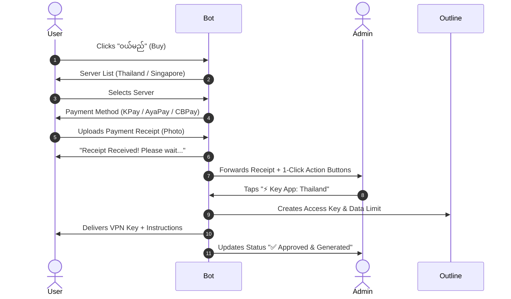

# 🤖 Ye Gu Saung VPN - Telegram Bot

An automated, multi-server **Outline VPN** subscription management and payment bot built with Node.js, Telegraf, and MySQL.

---

## ✨ Features

- 🌐 **Multi-Server Support**: Configure multiple Outline VPN servers (e.g., Thailand 🇹🇭, Singapore 🇸🇬) via environment variables with per-server pricing and optional DNS hostname mapping.
- 💳 **Dynamic Payment Methods**: Multi-wallet support (KPay, AyaPay, CBPay) with interactive step-by-step inline selection.
- ⚡ **1-Click Admin Approval**: Interactive inline buttons sent to your Telegram Admin Supergroup for instant key generation and plan extension.
- 📅 **Automated Subscription Lifecycle**:
  - Daily pre-expiry warning notifications (3 days before expiry at 08:00).
  - Automated deletion of expired keys from Outline servers and DB status update (at 08:30).
- 🔄 **Seamless Key Extension**: Extend subscription time for existing users without generating new access keys.
- 📊 **User Balance & Progress Tracking**: Graphical data usage progress bar, server location, and exact expiry dates.
- 🛡️ **Network Resilience**: HTTP/SOCKS proxy support (`HTTPS_PROXY`, `SOCKS_PROXY`), launch retry handler, and global error safety guards.

---

## 🛠️ Tech Stack & Requirements

- **Node.js**: v18.0.0 or higher
- **Database**: MySQL / MariaDB
- **Framework**: Telegraf (v4)
- **VPN Engine**: Outline VPN Server REST API
- **Scheduler**: `node-cron`

---

## 🚀 Quick Start & Installation

### 1. Clone & Install Dependencies

```bash
cd vpn-telegram-bot
npm install
```

### 2. Set Up Database

Import the SQL schema files into your MySQL database:

```sql
CREATE DATABASE vpn_bot DEFAULT CHARACTER SET utf8mb4 COLLATE utf8mb4_unicode_ci;
USE vpn_bot;

-- Run schema migration scripts in sql/ or 002_add_expiry.sql
```

### 3. Configure Environment Variables

Copy `.env.example` to `.env` and fill in your details:

```bash
cp .env.example .env
```

---

## ⚙️ Configuration (`.env`)

| Variable              | Description                                       | Example / Default                                 |
| --------------------- | ------------------------------------------------- | ------------------------------------------------- |
| `BOT_TOKEN`           | Telegram Bot API Token from @BotFather            | `8983851648:AA...`                                |
| `ADMIN_ID`            | Telegram Numeric User ID of Super Admin           | `xxxxxxxx`                                        |
| `GROUP_ID`            | Telegram Admin Group ID (Supergroup format)       | `-100xxxxxxxxx`                                   |
| `API_URLS`            | Comma-separated Outline API Secret URLs           | `https://ip1:port/secret,https://ip2:port/secret` |
| `SERVER_NAMES`        | Comma-separated Server Display Names              | `Thailand 🇹🇭,Singapore 🇸🇬`                        |
| `SERVER_PRICES`       | Comma-separated Server Prices                     | `xxx USD, xxx USD Ks`                             |
| `DNS_HOSTNAMES`       | (Optional) Custom DNS domain mapping per server   | `th.domain.com,sg.domain.com`                     |
| `KPAY_PHONE_NUMBER`   | KPay Transfer Phone Number                        | `09xxxxxxxxx`                                     |
| `KPAY_OWNER`          | KPay Account Owner Name                           | `Korea Admin`                                     |
| `AYAPAY_PHONE_NUMBER` | AyaPay Transfer Phone Number                      | `09xxxxxxxxx`                                     |
| `AYAPAY_OWNER`        | AyaPay Account Owner Name                         | `Korea Admin`                                     |
| `CBPAY_PHONE_NUMBER`  | CBPay Transfer Phone Number                       | `09xxxxxxxxx`                                     |
| `CBPAY_OWNER`         | CBPay Account Owner Name                          | `Korea Admin`                                     |
| `DEFAULT_LIMIT_GB`    | Monthly Data Limit per key (in GB)                | `100`                                             |
| `PLAN_DAYS`           | Default subscription period (in days)             | `30`                                              |
| `WARN_DAYS_BEFORE`    | Pre-expiry warning threshold (in days)            | `3`                                               |
| `TIMEZONE`            | Cron job timezone                                 | `Asia/Rangoon`                                    |
| `HTTPS_PROXY`         | (Optional) HTTP Proxy URL for restricted networks | `http://127.0.0.1:8080`                           |

---

## 📱 User Purchase & Admin Workflow



---

## 👮 Admin Commands

| Command      | Usage                                        | Description                                                                |
| ------------ | -------------------------------------------- | -------------------------------------------------------------------------- |
| `/chatid`    | `/chatid`                                    | Displays current Chat ID and type (Run inside group to find `GROUP_ID`).   |
| `/generate`  | `/generate <userId> [photoId] [serverIndex]` | Manually generates an Outline key and sends it to the user.                |
| `/extend`    | `/extend <userId> [days]`                    | Extends user subscription duration by X days without changing key.         |
| `/reissue`   | `/reissue <userId>`                          | Re-creates a fresh key on Outline preserving original subscription expiry. |
| `/deletekey` | `/deletekey <userId>`                        | Immediately revokes/deletes user's active key from Outline server & DB.    |

---

## 🏃 Running the Bot

### Development / Production Mode

```bash
node index.js
```

### Process Management with PM2

```bash
npm install -g pm2
pm2 start index.js --name "vpn-bot"
pm2 save
pm2 startup
```

---

## 🤝 Contributing

We welcome contributions! Please follow these steps:

1. Fork the repository
2. Create a feature branch (`git checkout -b feature/amazing-feature`)
3. Commit your changes (`git commit -m 'Add amazing feature'`)
4. Push to the branch (`git push origin feature/amazing-feature`)
5. Open a Pull Request

---

## 📄 License

[MIT](LICENSE)
